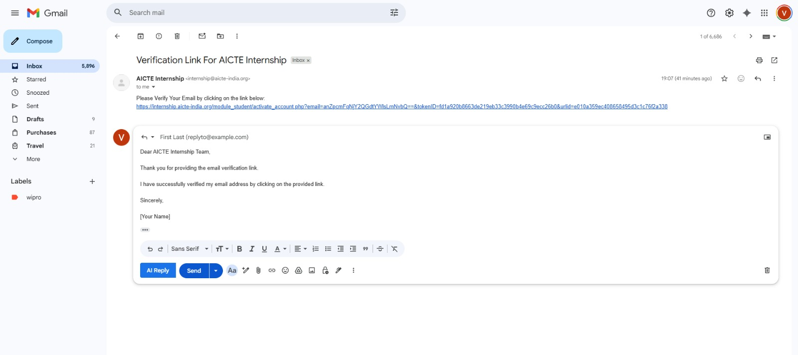

# AI Email Reply Generator

An AI-powered application that automatically generates email replies based on the content of the received email. This tool helps users save time, maintain professional communication, and respond quickly with well-structured messages.

---

## 🚀 Features

- AI-generated email replies
- Clean and simple user interface
- Fast response generation
- Customisable tone and style (if implemented)
- Browser extension support (if included in project)

---

## 🏗️ Project Structure

Email-reply-generator/
│
├── email-writer-extention/ # Browser extension
├── emailwriter/ # Backend service
├── emailwriter_frontend/ # Frontend application
└── README.md


---

## 🛠️ Tech Stack

**Frontend**
- HTML
- CSS
- JavaScript

**Backend**
- Java (Spring Boot)

**AI Integration**
- OpenAI API or similar LLM service

---

## ⚙️ Installation & Setup

### 1. Clone the repository
```bash
git clone https://github.com/vira250/Email-reply-generator.git
cd Email-reply-generator
2. Backend Setup (Spring Boot)
Navigate to backend folder:

cd emailwriter
Configure environment variables:

OPENAI_API_KEY=your_api_key_here
Run the application:

./mvnw spring-boot:run
or

mvn spring-boot:run
3. Frontend Setup
Navigate to frontend folder:

cd emailwriter_frontend
Install dependencies:

npm install
Start the development server:

npm start
4. Browser Extension
Open Chrome and go to:

chrome://extensions/
Enable Developer Mode

Click Load unpacked

Select the email-writer-extention folder

📌 Usage
Open the frontend or email extension.

Paste or load the email content.

Select reply tone (if available).

Click Generate Reply.

Copy and send the generated response.

🔐 Environment Variables
Create a .env file or configure environment variables:

OPENAI_API_KEY=your_api_key
'''
## 📷 Screenshots
### Reply Generation


### Browser Extension


🧩 Future Improvements
Multiple tone options (formal, casual, friendly)

Multi-language support

Email provider integrations (Gmail, Outlook)

Conversation history

Smart context memory

🤝 Contributing
Fork the repository

Create a new branch

Make your changes

Submit a pull request

